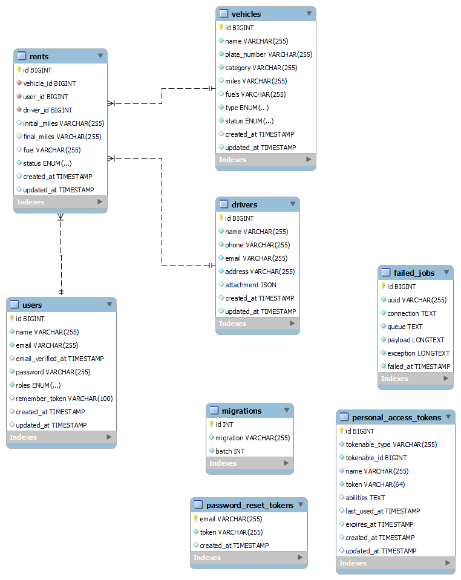
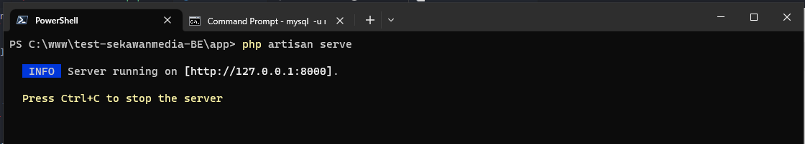
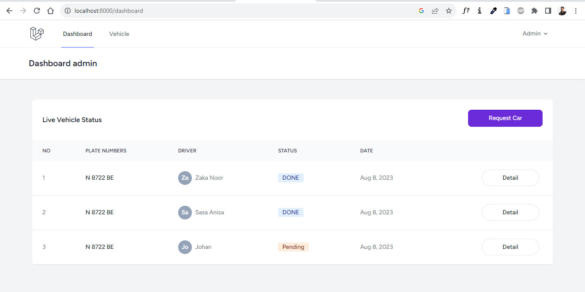
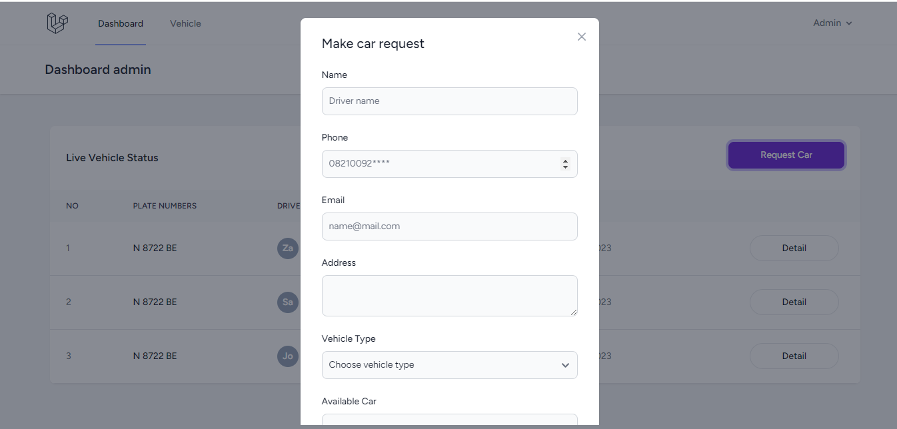
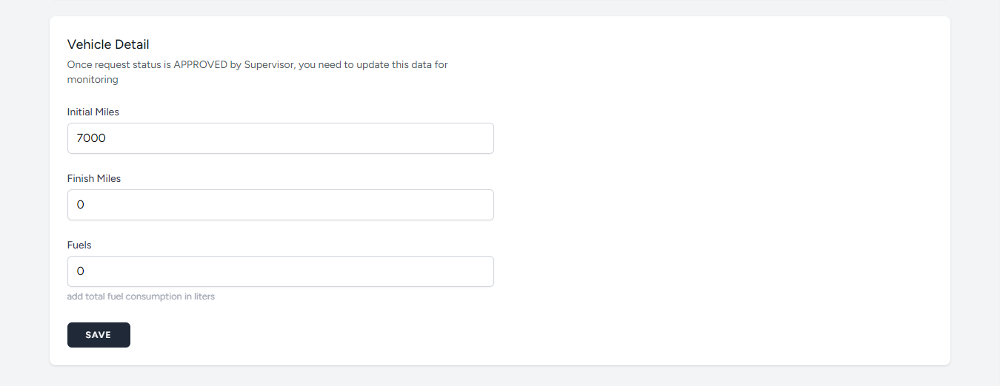
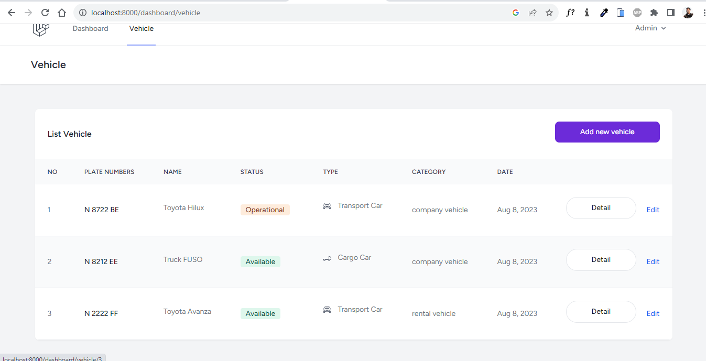
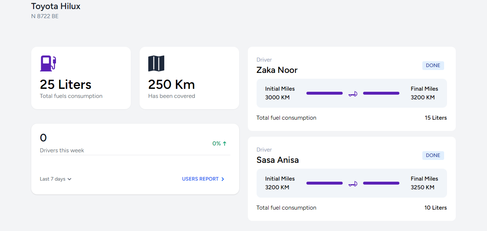
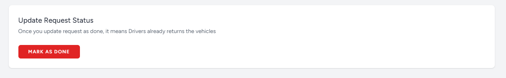
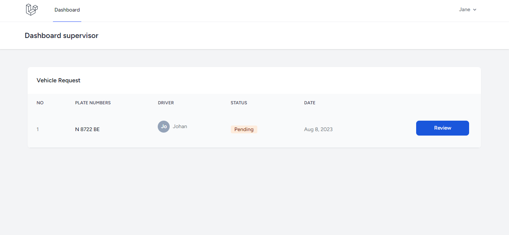
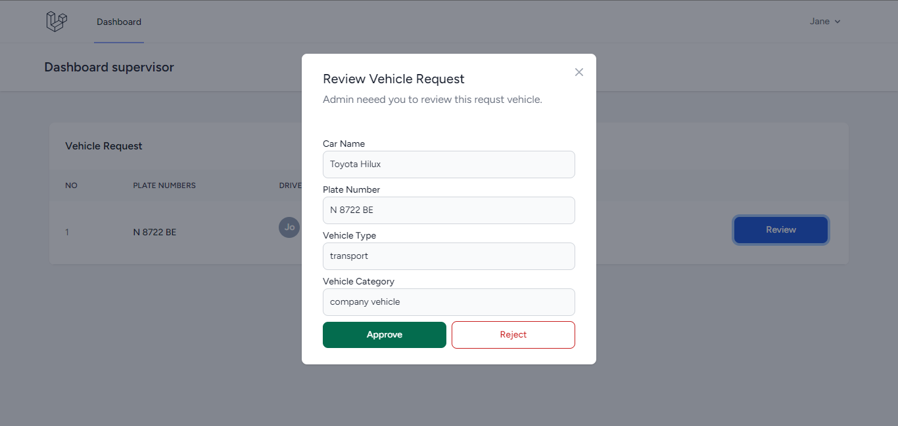

# test-sekawanmedia-BE

Web based application for monitoring car on [Nickel Company](https://career.sekawanmedia.co.id/uploads/technicaltest/1657615911_d6bc01e0cc1dbae7f7d9.pdf)

#### Physical data model

### Activity Diagram
https://lucid.app/lucidchart/ecbfd7ec-7b32-4616-932d-33cf29547ffe/edit?viewport_loc=-1045%2C13%2C1977%2C894%2C0_0&invitationId=inv_32f2126e-e7ba-4772-b380-cc684c71bb94

## Getting Started

These instructions will give you a copy of the project up and running on
your local machine for development and testing purposes. See deployment
for notes on deploying the project on a live system.

### Prerequisites

Requirements for the software and other tools to build, test and push 
- PHP Version 8 or above
- Composer
- npm or yarn
- MySQL

### Installing

A step by step series of examples that tell you how to get a development
environment running

clone this project

    git clone https://github.com/ZakaCoding/test-sekawanmedia-BE.git

Install project on your local computer

    composer install

Install depedencies

    npm install

After all depedencies installed, create new database

    mysql create database be_carrent

copy or rename file `.env.example` as `.env`

please adjust DB_DATABASE,DB_NAME,DB_PASSWORD with your database configuration

generate laravel key

    php artisan key:generate

Run migrations and seed

    php artisan migrate --seed

## Deployment

Run project with laravel artisan

    php artisan serve

and opened on web browser

    http://localhost:8000/dashboard

## Running the tests

For using this web application you need to have access. below this list all users (admin and supervisor).

### Admin
| Email  | Password |
| ------------- | ------------- |
| admin@admin.com  | pwd-admin1  |

Each user have different function. for admin, you can make vehicle request to supervisor and add new vehicle. Also you can export data to excel.

### Supervisor
| Email  | Password |
| ------------- | ------------- |
| andy@supervisor.com  | pwd-supervisor1  |
| jane@supervisor.com  | pwd-supervisor1  |
| john@supervisor.com  | pwd-supervisor1  |

With supervisor account you can approve or reject Car request from admin.

### Sample Tests

This simple manual book for operating this web application

#### Admin Dashboard
- Make car request
To do this action. you just need click button **REQUEST CAR**. then fill that form. After you make request, system will save the data into database and need supervisor to approve vehicle request.
Every request was you create. that will impact with Vehicle status. when you make request, vehicle status will change into `operational` it mean, you can't add the same vehicle for the next request until first request is done or reject by supervisor.

When supervisor approve vehicle request, you must update vehicle data. You can update that data.

- Update vehicle detail
This vehicle detail is important to track vehicle like (Fuel consumption, total distance from vehicle).
Click detail on table to do this feature.

- Add new vehicle
Goto tab vehicle or visit this link `http://localhost:8000/dashboard/vehicle`

How to track vehicle data ?
You can do that with click detail button. and from that page you can monitor every detail activity vehicle

- Mark request as done
When driver done with their activity and driver must return back the vehicles. to change status to `done` you just need click button `Mark as done` and make sure all vehicle detail data already filled.
After you mark is done, then Car status will change into  Available again.

#### Supervisor Dashboard
From this dashboard you can approve or reject every request was sent by admin.

## Authors

  - **Zaka M Noor** - *Full stack web developer* -
    [ZakaCoding](https://zakacoding.github.io)

See also my latest project
[open-cmap](https://open-cmap.fly.dev)
## Acknowledgments

  - Thanks to sekawanmedia to allow me with this test project

